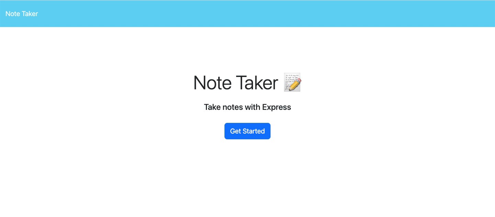

# Note Taker App

## Table of Contents

1. [Description](#description)
2. [Usage](#usage)

3. [Installation](#installation)
4. [Contributing](#contributing)

5. [Tests](#tests)

6. [License](#license)

7. [Questions](#questions)

## Description

Note Taker allows you to create, save and delete notes

## Usage

Assists you in keeping track of important notes and information needed for projects

Direct URL: https://note-taker-app-2023-cf0ac083be45.herokuapp.com/

## Installation

Express and UUID packages used

Will need to run 'npm install' and get the appropriate packages specified

## Contributing

Not Applicable

## Tests

Fork the repository

Run 'npm start' in terminal window

Visit http://localhost:3000 to test the note taker application (Heroku direct URL is provided as well if it's desired to test the application live instead of forking.)

## License

This project is licensed under the [MIT](https://opensource.org/licenses/MIT) license.

## Questions

Find me on GitHub: [EliteHuskie](https://github.com/EliteHuskie)

Contact me at: [EliteHuskie@gmail.com](mailto:EliteHuskie@gmail.com)